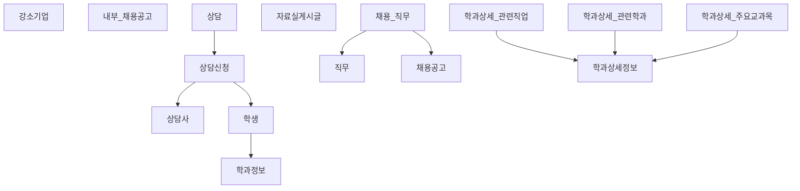

# 대학일자리플러스센터 웹 시스템 개발 보고서
**개발 기간**: 2025년 9월 ~ 2025년 12월
**개발 방식**: Grok AI와 실시간 협업 (요구 → 즉시 구현 → 피드백 → 수정 반복)

## 프로젝트 개요
- 통합 취업지원 플랫폼 (채용정보, 상담신청, 교육행사, 자료실, 관리자 검수)
- FastAPI + MySQL + Jinja2 + Vanilla JS 기반
- 디자인 완전 통일 (#003087 메인 컬러, Roboto 폰트, 900px 중앙 정렬)

## 완성된 기능 목록

| 번호 | 기능명                     | 상태   | 비고 |
|------|----------------------------|--------|------|
| 1    | 메인 페이지                | 완료   | 최신 공고/행사 노출 |
| 2    | 채용정보 목록              | 완료   | 검색 + 4종 필터 + 페이지네이션 |
| 3    | 채용 상세보기              | 완료   | 클릭 시 이동 |
| 4    | 외부업체 채용공고 작성     | 완료   | job-post.html |
| 5    | 자료실 게시판 (목록)       | 완료   | 검색 + 공지 상단 고정 |
| 6    | 자료실 글 작성             | 완료   | resources_write.html |
| 7    | 자료실 상세보기            | 완료   | resources-detail.html |
| 8    | 관리자 통합 검수 대시보드  | 완료   | 채용공고 + 상담신청 한 화면에서 검수 |
| 9    | 네비게이션 드롭다운        | 완료   | 채용정보·상담신청·교육행사 하위 메뉴 |
| 10   | 반응형 레이아웃            | 완료   | 데스크톱 최적화 (모바일은 추후) |

## 데이터베이스 설계 (MySQL)

## 디자인 특징 (모든 페이지 공통)
- **고정 헤더 & 푸터**  
- **메인 컬러**: `#003087`  
- **폰트**: Google Roboto (400, 500, 600, 700)  
- **컨테이너 최대폭 900px 중앙 정렬**  
- **카드형 UI + 호버 애니메이션** (transform + shadow)  
